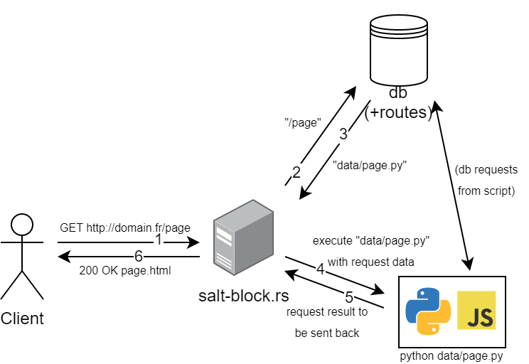

# Salt block webserver

## Description

Une tentative de serveur web type "Common Gateway Interface" en Rust.
Le but étant de pouvoir créer des pages en n'importe quel langage scripté voire compilé et de les servir en Rust.

## Fonctionnement

1. Le client fait une requête HTTP au serveur
2. Le serveur demande le chemin du fichier à la database pour l'URI demandée
3. La database renvoie le chemin du fichier ou une erreur
4. Si la database renvoie une erreur, le serveur renvoie une erreur 404 au client, le cas contraire, si
le fichier demandé est un fichier texte type html/css/js, le serveur renvoie le fichier au client, si le fichier est un fichier exécutable
ou un script python/javascript ou autre, le serveur exécute le script en passant les détails de la requête HTTP au script.
5. Le script renvoie une réponse au serveur qui la renvoie au client à travers la sortie standard.
6. Le serveur renvoie la réponse au client.

----

----
